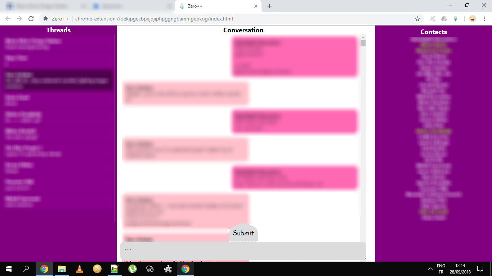
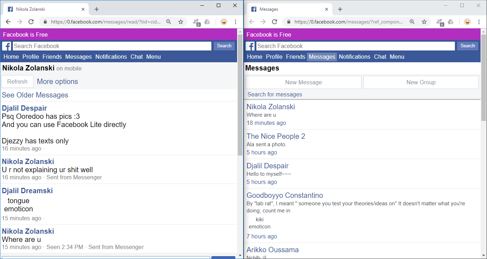

# Zero++
A Chrome extension that improves Facebook Zero's messaging functionality. [WIP]

With a few edits, it should work fine with any headless browser (something like *Puppeteer* or *PhantomJS*), in order to use it in different environments (desktop, mobile, idk)

I believe I've overcome the main difficulties (mostly technicalities). Still, this shit is messy and totally incomplete -- I am *Kaito the Prokrastinato~* after all... I may finish this thing some time in the future.

## Things I Hate About Facebook Zero
*These are the things I tried to solve.*

- **Updating**: You need to manually refresh the page to get new content.
- **Messages requests** are not indicated, you need to manually click on `View Message Requests` to check whether any exists.
- **Emoji** and emoticons are replaces by text: for example `:p` becomes `tongue emoticon`
- **Resend**: On poor connections, messages get lost when errors occur.
- **Media**: No images, videos, audios, no thing!
- **RTL**: doesn't handle right-to-left scripts (like Arabic) and "mixed directions"
- **Message bubbles** are missing
- **Status**: if you stop refreshing the page, your status becomes `inactive`.
- Other stuff: 'stickers' suffer like 'emoticons', but they ain't important.

## Screenshot
This was the first (and last) working app and before it was ruined by *Moi*:
- Date: 2018-09-28
- Google Chrome v69 x64
- Windows 10 Pro x64 (not that it matters...)



Instead of something like this:



## How it works
Basically, it consists of three `Promise`-based parts: Messenger, Master and Worker (and "Broker"):

- **Messenger** (`/app`): A typical instant messaging interface. It interacts directly with the user,
and updates its datastore when the user does something or **Master** receives new data.

- **Master** (`/src`'s classes): Creates new `Worker`s (hidden windows -- `iframe`s actually) and gives them orders... and kills them when they lose their *raison d'être*.

- **Worker** (`/src/ZeroWorker`): Once loaded it listens for Master's orders and obeys them (and may send Master a response).

- **Broker** (`/src/ZeroBroker`): My original idea. A bot that turns binary into text (base64), sends them to *Moi*, where they get turned back into binary: images and stuff...

### Assumptions
- User doesn't change the active account (important for not mixing conversations and stuff)
- User doesn't delete messages manually (important for fetching and ordering messages)
- Usernames won't change while using the App (important for caching)
- The language used by the active user is English (important for parsing information)
- User doesn't send the same messages more than once (important for error recovery -- "auto-resend")

### Example
*The API was radically changed, this no longer works...*
```js
(async () => {
  const me = await Zero.getMyInfo()

  const recipientsIds = [
    '@alice',
    '@brian666'
    ]
    .map( username => await Zero.getProfileInfo(username))
    .map( user => user.id)

  const firstMessage = 'Yo!'

  const group = await Zero.newGroup(recipientsIds, firstMessage)

  console.info('The message was sent to a new group')

})();
```

### UMl Class Diagrams
*Just started scratching in Microsoft Visio 2016: Check `zero-classes.vsdx`*.

## TODO
- Variables that reference `HTMLElement`s should start with `$`: e.g. `$footer`
- Use Facebook.com's cookies to check the current user (`c_user`) and their language (`locale`)?

## License
CC0
