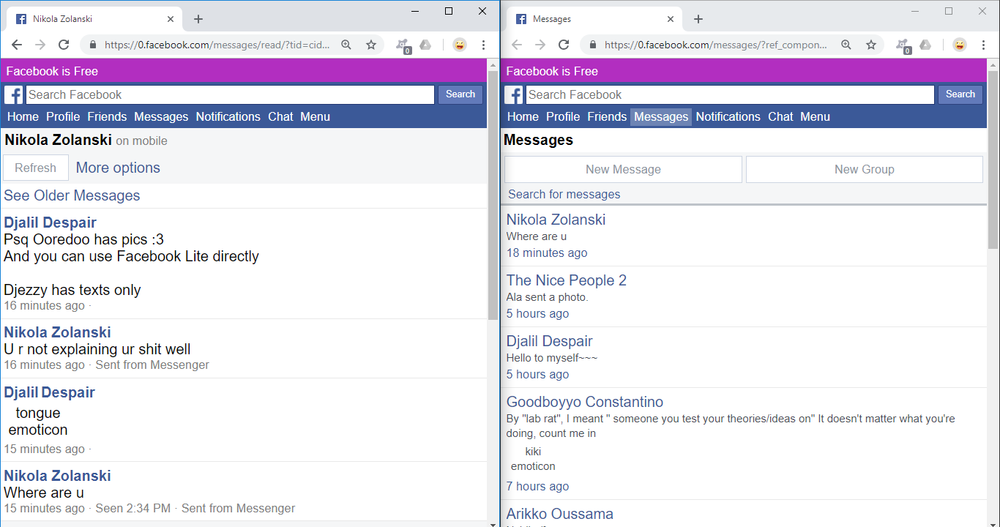

# ZeroMessenger
https://blog.djalil.me/posts/zero

An app that improves Facebook Zero's messaging functionality. (0.facebook.com/messages) \[POC\]

I believe I've overcome the main difficulties (mostly technicalities). Still, it is messy and incomplete...
I may finish this thing some time in the unforeseeable future.

With a few edits, it should work fine with any headless browser (something like *Puppeteer* or *PhantomJS*) in order to use it in different environments (desktop, mobile, or whatever).

## Things I Hate About Facebook Zero
*These are the things I tried to solve.*

- [x] **Refreshing**: You need to manually refresh the page to get new content: new messages, new threads, active contacts, etc.
- [x] **Status**: if you stop refreshing the page, your status becomes `inactive`.
- [x] **Emoji** and emoticons are replaces by text: for example `:p` becomes `tongue emoticon`.
- [x] **Resend**: On poor connections, messages get lost when errors occur.
- [x] **Multimedia**: No images, videos, audios, no nothing! *\[incomplete\]*
- [ ] **Messages requests** are not indicated, you need to manually click on `View Message Requests` to check whether any exists.
- [ ] **RTL**: doesn't handle right-to-left scripts (like Arabic) and "mixed directions".
- Other stuff: 'stickers' suffer like 'emoji' but that's fine, nobody really uses them anymore.

## Screenshot
Instead of something like this:

How about this:

(*Screenshot: 2018-10-10, Google Chrome v69, Windows 10 Pro x64*)

## Installation
Google Chrome doesn't allow extensions off its store. You'll have to do this:

- Download this repo (as zip or `git clone` it)
- Go to `chrome://extensions`
- Activate "developer mode"
- Drag and drop the downloaded folder to install it

Each time you reopen Google Chrome, it will ask you to disable the extension, just reject that message.

## How Does It Works?
[Check this drafty post](docs/blog-post.md).

Basically, it consists of four `Promise`-based parts: Messenger, Master, Worker, and "Broker":

- **Messenger** (`/extension/app`): A typical instant messaging interface. It interacts directly with the user,
and updates its datastore when the user does something or **Master** receives new data.

- **Master** (`/extension/src`'s classes): Creates new `Worker`s (hidden `iframe`s) and sends them orders... and finally kills them when they lose their *raison d'être*.

- **Worker** (`/extension/src/ZeroWorker`): Once loaded it listens for Master's orders and obeys them (and may send Master a response).

- **Broker** (`/extension/src/ZeroBroker`): My original idea. A bot that turns binary into text (base64), sends them to *Moi*, where they get turned back into binary: images and stuff... Currently, Zerofy is used to do it "manually".

### Assumptions
- User doesn't change the active account (important for not mixing conversations and stuff)
- User doesn't delete messages manually (important for fetching and ordering messages)
- Usernames won't change while using the App (important for caching)
- The language used by the active user is English (important for parsing information)
- User doesn't send the same messages more than once (important for error recovery -- "auto-resend")

## Coding style
I generally try to follow [AirBnB's JavaScript Style Guide](https://github.com/airbnb/javascript).

- Variables that reference regexes start with `r`, as in `const rDigit = /^[0-9]$/`.
- Variables that reference HTML elements start with `$`, as in `const $form = document.querySelector('from')`.
- In Vue components, `z-` is my `ZeroMessenger`'s namespace. (This app requires no build step. Change that?)
- **On ZeroWorker, semicolons are omitted. Fix that?**

## TODO
Check `docs/ideas.txt` and `.js`.

- [ ] UML: Update the class diagram to reflect changes in code!
- [ ] CSS: Use grid or flex instead of floats, stupid!!
- [ ] Initially set `Moi`'s status to 'unknown' (and not "active"), before actually getting the true status.
- [ ] When sending messages, use **message composer** (as opposite to using a "normal" chat page).
  this way, old messages (which may be very long) won't be loaded.
- [ ] Use ZeroChats' first/last timestamps to set messages' dates `createdDate`.

## License
CC0
