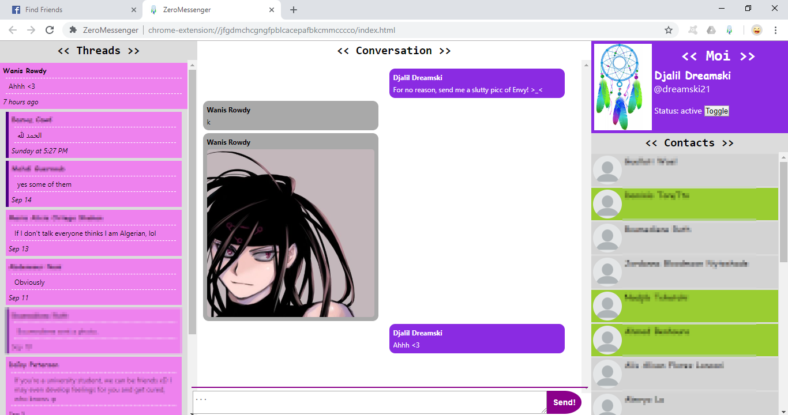

# ZeroMessenger: Improving Facebook Zero's messaging functionality

*Djezzy* is an Algerian mobile network operator. Djezzy provides a zero-rated, text-only version of Facebook: Facebook Zero (0.facebook.com) or 0FB for short.

Some students (like myself) are practically poor and cannot afford a real internet access so they end up relying on this service. What I'm presenting here is my attempt at making Facebook Zero a better shit.

> *Turning something like this:*


> *... into something like this:*


**Disclaimer: This drafty post is a super simplistic explanation of how I wrote an incomplete project that used a discontinued service.**
**Still, I wanted to publish it since it might be useful to others...**

## Idea

After "studying" (i.e. using) Facebook Zero for over a year, I realized that the website is very predictable and has a RESTful-like "structure".

The idea is simple: *If I can manipulate only texts then that's what I'm gonna do*:

We treat Facebook Zero as if it were merely a messy database and an intermediate to exchange data.  
So, to send a photo (or any file for that matter), first convert it to text (*base64*) and send it as a text message.  
On the other side, the recipient should convert it back to binary and view it.

## Gathering data

As I have already intimated, 0FB pages are so predictable that a few `document.querySelector` lines allow us to obtain the necessary information to work with.

### Profiles
These are the most important information we need: `id`, `name`, `username`, `hasGreenDot` (which signifies the user is active).

- **name** is easily obtained using this simple statement:
```js
const name = document.querySelector('#objects_container strong').innerText // 'Djalil Dreamski'
```

- **username**, **phoneNumber**, and **gender**...
```js
// Okay, suppose we are on a profile's info page (e.g. https://0.facebook.com/zuck?v=info)
// We can use these two lines to get the user's gender:
const rawGender = document.querySelector(`#root [title="Gender"]`).innerText.trim() // 'Gender\nMale'
const gender = gender.split('\n')[1].toLowerCase() // 'male'

// The above two lines can be used to get other (*useful*) information, like the `username`
// so let's turn it into a more general and less error-prone function:
function getAttr(attr, lowerCase = true) {
  const $container = document.querySelector(`#root [title="${attr}"]`)
  if ($container) {
      let text = $container.innerText.trim()
      if (lowerCase) text = text.toLowerCase()
      const val = text.split('\n')[1]
      return val
  } else {
      return ''
  }
}

// Now we can use it like this:
const username = getAttr('Facebook') // '/zuck'
const phoneNumber = getAttr('Mobile') // ''
```

- **id**  
  
As far as I know, Facebook assigns an id (*FBID*) to each of its objects (profiles, groups, posts, messages, etc.).  
In every 'messageable' profile ("page" or "user") webpage, there exists a 'Message' button (a link, actually). We can use this link to get the profile's id.  
We can either look for a link whose text content consists of "Message", or whose URL starts with a specific prefix. I chose the latter approach:

```js
// Supposing we're on a user's page, and that this user has a 'Message' button/link
const linkPrefix = 'https://0.facebook.com/messages/thread/'
const messageLink = Array.from(document.querySelectorAll('a')).find(a => a.href.startsWith(linkPrefix))
const [, id] = messageLink.match(/thread\/(\d+)/)
// If we were on 0.facebook.com/zuck, 'id' would be '4'
```

- **My id**  

We assume I'm already logged in. To get my id, we go to my profile page (`/profile.php`) and extract it from the "Registo de atividade" ("Activity Log") link.  
We basically repeat the same work we did earlier with `id` but this time the link has this pattern: `https://0.facebook.com/<MY_ID>/allactivity`.  
**Note: Many pieces of code in my app are currently language specific (only English works for now).**

- **hasGreenDot** was a little tricky at first as I couldn't just use a simple CSS selector that identifies it:
Apparently some parts of Facebook Zero pages get automatically minified/uglified
so some classes get renamed randomly (e.g. 'cg', 'rt', etc.).  
One thing was sure: If the current page contains a *greenDot*, there will be a class in the 'style' tag, whose body contains nothing but this rule: `{color:#6ba93e;}`.

```js
// We could use the above information to do this:
const styleHtml = document.querySelector('style').innerHTML
const hasGreenDot = styleHtml.includes('{color:#6ba93e;}')

// But since we will be using that approach in other places (and for other purposes),
// we actually use a method that retrieves the class's name if it exists.
function getClassName(rule) {
  const styleHtml = document.querySelector('style').innerHTML
  const escapedRule = rule.replace(/[{}().]/g, '\\$&') // This should do.
  const rRule = RegExp('\\.(\\w+?)' + escapedRule)
  const [, className] = styleHtml.match(rRule) || []
  return className || ''
}

// The following may be an empty string or (probably) a two-character name
// const greenDotClassName = getClassName('{color:#6ba93e;}')
// const hasGreenDot = !!greenDotClassName
```

Finally, we create a "public" function that gathers all of that information using the above snippets and then returns it.  
This function will be attached to the `ZeroWorker` namespace (The purpose of this will be shown later).
```js
// ZeroWorker is declared globally as `const ZeroWorker = {};`
ZeroWorker.getProfileInfo = function getProfileInfo() {
  // ...
  return { id, myId, name, username, hasGreenDot, gender }
}
```

### Conversations


We can see a chat page's markup like this (at least this is what I recall):

```html
<div> <!-- HEADER -->
  <strong>Name!</strong>
  <span>greenDot?</span>
  <span>statusText (e.g. "Active a few seconds ago")?</span>
  <a>Link to chat group info?</a>
</div>
<div id="messageGroup">
  <a id="see_older">See Older Messages</a>
  <div>
    <div>MESSAGE_BLOCK_1</div>
    <div>MESSAGE_BLOCK_2</div>
  </div>
  <a id="see_newer">See Newer Messages</a>
</div>
```

<br>


- Each conversation has an id (*cid*) AKA thread id (*tid*).
  - Group chats contain a 'cid'.
  - Individual conversations contain user's id and my id: `cid=ID_X:ID_Y`. My id is either ID_X or ID_Y... Having already obtained my id, the recipient's id is simply not-my-id.
  - We can use the individual chat id to get more information about the recipient as shown in the **Profiles** section, using a link like `/profile.php?fbid=<THEIR_ID>&v=info`.

- In each conversation, we can use the `see_older` and `see_newer` links to obtain timestamps of the last and first messages (respectively) in the target section.

- Messages can be grouped together in what I call "message blocks". That happens when a user sends multiple messages consecutively.

- Each *message block* contains 'message ids' (*mids*).  
Clicking on the **Delete Selected** link (on the bottom), shows a "Delete" button next to each message. This button is actually a link that contains the message's mids.

These attributes can be used to automatically update the conversation by fetching new messages and deduplicating repeated ones (for technical reasons, duplicates can appear).

As with profiles, using the mentioned specifications, we write a function that collects the needed data and returns it:

```js
ZeroWorker.getChat = function getChat() {
  // ...
  return { name, messages, hasGreenDot, statusText, groupInfoLink, seeOlderLink, seeNewerLink }
}
```

---

As for sending messages, we use a simple function that performs the actions a user normally does:
Fill in a message and then click send (submit).

Again, we attach this method to the ZeroWorker namespace.

```js
// This code should be self-explanatory.
ZeroWorker.sendText = function sendText(str) {
  const $form = document.querySelector('#composer_form')
  const $input = $form.querySelector('textarea')
  $input.value = str
  $form.submit()
}
```

## Parts

Basically, it consists of three `Promise`-based parts: Messenger, Master and Worker (in addition to "Broker").

> 
`ZeroMessenger.uml` exported as image using *WhiteStarUML*.

### ZeroWorker

A ZeroWorker (presented in the **Gathering Data** section) runs on iframes that are opened by **Master**. (ZeroWorker's scripts get automatically injected in 0FB iframes thanks to Chrome Extension API).

A Worker listens for orders, executes them, and finally sends a response to Master. *ZeroWorkers* and *Masters* communicate via [cross-document messaging](https://developer.mozilla.org/en-US/docs/Web/API/Window/postMessage).

The following code shows how jobs are handeled.
**This is the reason we have been attaching everything to the ZeroWorker namespace: To dynamically access needed functions.**
```js
window.addEventListener('message', ZeroWorker.onOrder, false)

ZeroWorker.onOrder = function onOrder(event) {
  const job = event.data
  const response = ZeroWorker[job.fn](...job.args)
  // Add some useful 'metadata' that Messenger uses to keep its data consistent and up-to-date
  response._pageDate = Date.now()
  response._pageLink = window.location.toString()
  event.source.postMessage({job, response}, '*')
}
```

### ZeroMaster

Actually just **Master**.

It spawns ZeroWorkers (i.e. iframes), sends orders (`job`s) to them, then listens for responses.

A Master `kill()`s the Worker he spawned when they lose their *raison d'être* (i.e. the `job` is done).

Also, Master deals with actions that make the page reload (for instance, sending messages) and handles time-outing requests (happens often on shitty cell connections like mine).
```js
const username = 'dreamski21'
const job = {fn: 'getProfileInfo', url: `https://0.facebook.com/${username}?v=info`}
const master = new Master(job)
master.getResponse().then( (res) => {
  console.info(`${res.name} is ${res.hasGreenDot? 'online' : 'offline'}`)
})
// Probably outputs: "Djalil Dreamski is offline"
```

As for how it works:
  - Master assigns a unique id to each `job` object.
  - It sends (`posts`) the job to the worker and starts listening for a response with that id.
  - When a response arrives, the promise is resolved with the response's data object (or rejected if something goes wrong).
```js
class Master {
  // ...

  _launch() {
    return new Promise( (resolve, reject) => {
      const onMessage = (event) => {
        const data = event.data;
        if (data && data.job && data.job.id === this.job.id) {
          // Perfect, this is the event we were listening for.
          removeListener()
          if (data.response && !data.response.error) {
            resolve(data.response)
          } else {
            const err = (data.response && data.response.error) || 'Response err'
            reject({error: err})
          }
        }
      }

      const removeListener = () => window.removeEventListener('message', onMessage, false)

      // Start listening and then tell ZeroWorker to do the job
      window.addEventListener('message', onMessage, false)
      this._iframe.contentWindow.postMessage(this.job, '*')
    })
  }

}
```

### ZeroMessenger

ZeroMessenger is the interface that interacts directly with the user.

Again, it abstracts ZeroMaster and ZeroWorker by providing dedicated classes and methods. For example:

```js
class Message {
  // ...

  /**
   * Sends a text message.
   *
   * @param {string} id - Conversation id
   * @param {string} text
   * @returns {Promise<object>} "Zero Response" from ZeroWorker 
   */
  static async send(id, text) {
    // url = `https://0.facebook.com/messages/read?fbid=${id}&show_delete_message_button=1
    const url = Conversation.getChatLink(id)
    const job = {url, fn: 'sendText', args: [text], reloads: true}
    const res = await (new Master(job)).getResponse()
    return res
  }
}
```

And so on, we write classes `Profile`, `Conversation`, and sub-classes as shown in the UML class diagrams above.

These classes open different pages/links to do different things. For example, to get a user's info, you open their profile info page then invoke *Worker* (by specifying `getProfileInfo` as its job) to read and send that info to you.

Messenger contains all the other parts/classes and eases interaction between them. For instance, to distinguish between my id and another user's, `Profile.getTheirId(url)` needs to know my id which is stored in `Messenger.moi.id`.

As for dynamically updating the content, ZeroMessenger periodically checks Facebook Zero, the same way a user refreshes pages every few seconds. *Really, the goal of this project was to mimic the user's actions + add photos.*

---

By this point, I have created a good enough API for working with Facebook Zero; the rest is just a basic chat/instant-messaging app.

Once upon a time when *nwjs* was called *node-webkit* and when `Object.observe` was not deprecated, I wrote an **APK Manager** with a reactive view by observing 'data objects' and updating the DOM when changes occur. It was a fun and interesting project to work on... However, this time I decided to stop reinventing the wheel and use VueJS to handle reactivity, so I can focus on the app's logic.

### ZeroBroker

This is actually [my original idea](https://github.com/dreamski21/shit/blob/master/2018-03/ZeroFB++.js): A "proxy bot" to send and receive binary data using only texts.

**It's inspired by the TCP protocol** and it works like this:

The bot logs in using my account and starts watching for incoming messages (including those I send to myself).

* **Receiving**: If I receive a file (a photo for example), the bot should:
  - Download it
  - Convert it to text and then split it into messages
  - Add metadata to those messages
  - And finally send those messages to my inbox.

* **Sending**: If I want to send a file to someone:
  - I simply select something and send it, as in any messaging app.
  - ZeroMessenger reads the file and sends its textual representation to my inbox, in addition to some metadata (like whom it is sent to).
  - ZeroBroker checks my inbox, collects those pieces, converts them to a binary file, then sends that file to the recipient as if it were sent directly by me.
  - The Broker informs me of the progress by sending updates to my inbox. (Feels like talking to myself. Weird.)

I didn't finish it but I made *Zerofy* which lets you do half of the job "manually" (**sending**),
while the other half is done automatically (**receiving**).

## Technicalities and Regrets

* Each message can contain a little more than 2^16 characters, which is approximately 16KB. That requires the image's textual representation to be split into chunks and sent separately.

* Making a simple/limited API for 0FB was tricky since Facebook adds a token named `gfid` (whose value is randomly generated) to some links and forms (probably in order to fight CSRF attacks). This means that some pages need to be opened in order to get the value of `gfid` before actually doing the desired actions: Sending and deleting messages, and changing my Active Status.

* Facebook's HTTP response contains a header that tells the browser to not allow iframes. We simply intercept the response and remove this troublesome header.

---

Data is half processed by *Worker* and the rest is handled by *Messenger/Master*.
That's confusing. Only one of them should take the responsibility and do most the work (preferably Messenger while Workers only gather raw data and "obey orders").

---

The way ZeroMessenger works is similar to crawlers (which Facebook tries to prevent), this necessitates that we mimic a browser. I could use libraries to grab pages (using `axios`), parse them and extract relevant info (using `cheerio`), compose requests and send them. This solution would be independent of the browser, and works on Node, the possibilities would be limitless...

That wasn't what I did. Wanting to keep it simple and having used Google Chrome's Extension API before, I decided to use iframes and inject scripts into them. This is a bad approach since it's costy (needlessly rendering pages and loading images) and gives less control (like catching network errors and redirects and stuff).

## Conclusions

- And there you have it, 0FB is a better shit.
You can check the source code [on GitHub](https://github.com/dreamski21/zero)... and why not fork it and finish it...

- JavaScript is amazing: It has simple and powerful APIs that can be used to make complex projects.

- VueJS is beautiful: Simple syntax and, as its website promotes it, "incrementally adoptable".

- *Nothing compares to learning by doing: In reality, this was a huge experimental project: VueJS, Promises and async/await, postMessage API, "parallelism", etc.*

## Acknowledgments

I'd like to thank my friend Wanis R. for the help he provided (beta reading, beta testing, allowing me to use his real internet sometimes, etc.) and for his continuous support and encouragement.

**2018-11 Update**: Djezzy's Facebook Zero and Wikipedia no longer work. Sad.
